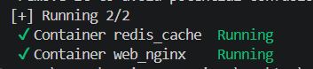
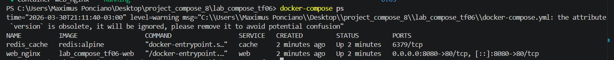

# Docker Compose - TF06

## 📌 Descrição

Projeto utilizando Docker Compose para orquestrar:

* Servidor Nginx (build customizado)
* Cache Redis com persistência

---

## 🚀 Subindo o ambiente

```bash
docker compose up -d
```

---

## 📷 Evidência - Criação dos containers

```

```

---

## 📷 Evidência - Serviços ativos

```

```

---

## 🔗 Teste de comunicação entre serviços

```bash
docker exec -it web_nginx sh
ping cache
```

✔️ Resultado esperado: comunicação funcionando via DNS interno do Docker

---

## 📁 Estrutura

```
lab_compose_tf06/
├── docker-compose.yml
├── nginx/
│   └── Dockerfile
└── README.md
```
